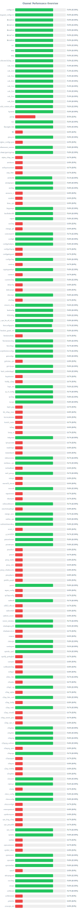

# Multi Proxy Config Fetcher

This project automatically fetches and updates various proxy configurations from public Telegram channels, SSCONF links and other URLs containing configuration data. It supports multiple proxy protocols including WireGuard, Hysteria2, VLESS, VMess, Shadowsocks, TUIC, and Trojan.

## Channel and URL Performance

Below is the real-time performance statistics of the configured sources (Telegram channels and other URLs). This chart is automatically updated every hour.

### Quick Overview
<div align="center">
  <a href="assets/channel_stats_chart.svg">
    
  </a>
</div>

### Detailed Report
📊 [View Full Interactive Dashboard](https://htmlpreview.github.io/?https://github.com/${{ github.repository }}/blob/main/assets/performance_report.html)

Each source is scored based on four key metrics:
- **Reliability Score (35%)**: Success rate in fetching and updating configurations.
- **Config Quality (25%)**: Ratio of valid configs to total fetched configurations.
- **Config Uniqueness (25%)**: Percentage of unique configs contributed.
- **Response Time (15%)**: Server response time and availability.

The overall score is calculated in real-time and updated hourly. Sources scoring below 30% are automatically disabled.

> **Note**: The sources listed are examples. You can easily modify the source list in `src/config.py` to use your preferred Telegram channels, SSCONF links or other URLs. The performance metrics shown above are based on real-time monitoring of each source's reliability in providing valid configurations.

## Features

- Supports multiple proxy protocols:
  - WireGuard
  - Hysteria2
  - VLESS
  - VMess
  - Shadowsocks (SS)
  - Trojan
  - TUIC
- Fetches configs from:
  - Public Telegram channels
  - SSCONF format links
  - URLs hosting configuration files
- Smart handling of base64-encoded configs (preserves original format)
- Protocol-specific validation and verification
- Automatically updates configs every hour
- Validates config age (excludes configs older than 7 days)
- Removes duplicates
- Real-time source performance monitoring
- Automatic source health management
- Dynamic protocol distribution balancing

## Setup

1. Fork this repository.
2. Edit `src/config.py` and add your Telegram channels, SSCONF links or other URLs to the `SOURCE_URLS` list.
3. Enable GitHub Actions in your forked repository.
4. The configs will be automatically updated every hour in `configs/proxy_configs.txt`.

## Manual Setup

```bash
# Clone the repository
git clone https://github.com/yourusername/multi-proxy-config-fetcher.git
cd multi-proxy-config-fetcher

# Install dependencies
pip install -r requirements.txt

# Run manually
python src/fetch_configs.py
```

## Configuration

Edit `src/config.py` to modify:
- Source list (Telegram channels, SSCONF links or URLs)
- Minimum/maximum configs per protocol
- Protocol ratios and balancing
- Maximum config age
- Output file location
- Supported protocols
- Request headers and timeouts

## Note for Forked Repositories

If you fork this repository, you need to manually enable GitHub Actions:
1. Go to `Settings > Actions` in your forked repository.
2. Select **Allow all actions and reusable workflows**.
3. Save the settings.

## Project Structure

```
├── src/
│   ├── config.py              # Project configuration
│   ├── config_validator.py    # Config validation and verification
│   └── fetch_configs.py       # Main fetcher implementation
├── configs/
│   ├── proxy_configs.txt      # Output configs
│   └── channel_stats.json     # Source performance stats
└── .github/
    └── workflows/
        └── update-configs.yml # GitHub Actions workflow
```

## Source Statistics

The project tracks comprehensive performance metrics of each source in `configs/channel_stats.json`:
- Overall performance score (0-100%)
- Success rate in fetching configurations
- Valid vs total configs ratio
- Unique config contribution
- Response time and reliability
- Source health status

## License

This project is licensed under the MIT License - see the [LICENSE](LICENSE) file for details.

## Contributing

Contributions are welcome! Please feel free to submit a Pull Request.

## Disclaimer

This project is provided for educational and informational purposes only. The developer is not responsible for any misuse of this project or its outcomes. Please ensure compliance with all relevant laws and regulations when using this software.

## About the Developer

Developed by **4n0nymou3**.  
For more information or to contact the developer, visit their [X (Twitter) profile](https://x.com/4n0nymou3).